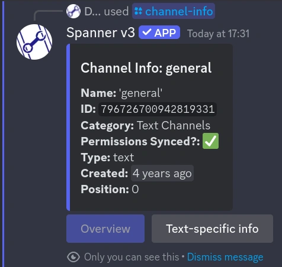
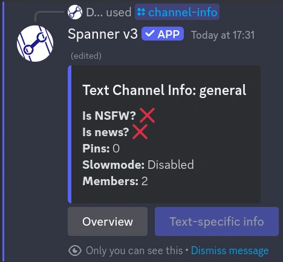
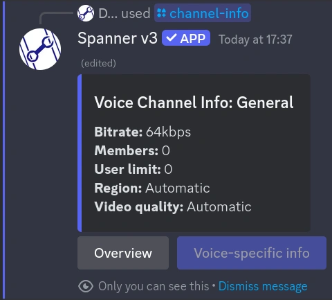
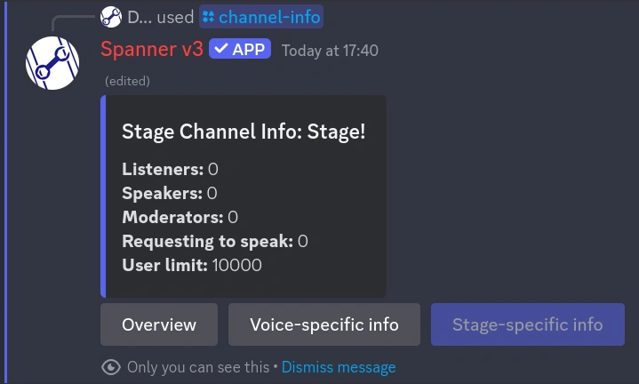
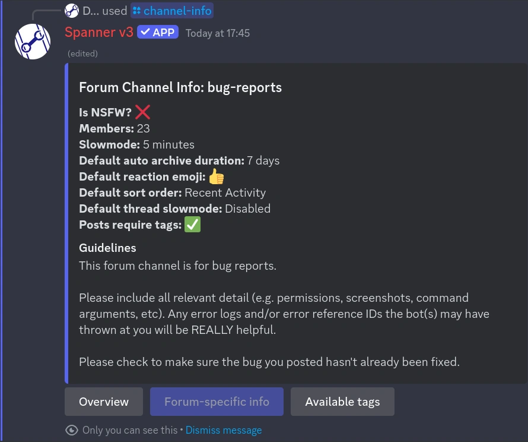
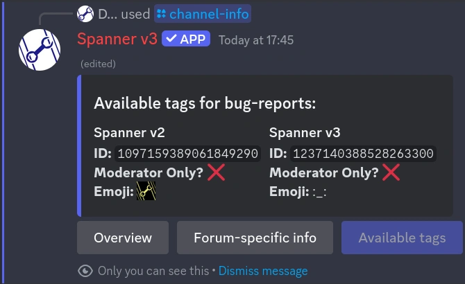
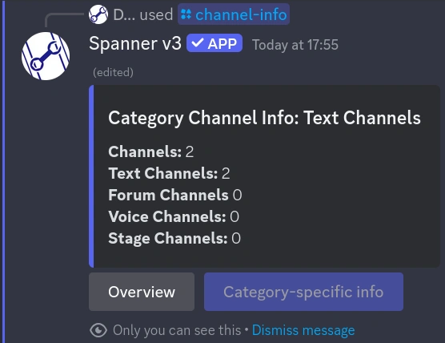

# /channel-info | Channel Info

!!! tip "This feature is available everywhere!"

    This command is available in both a guild context, and user context! See
    [Installation](../0000-getting-started.md#1-installation) for more information!

Channel Info gives you a bunch of information about the current or given channel.
Basic information contains the channel name, ID, type, category, creation date, position, and the permission sync
status.

More information is available for specific types of channels, such as voice channels, text channels, and categories.



## Usage

```text
/channel-info channel:name
```

If `channel` is not provided, the current channel will be used.

This command will respond with an "ephemeral" (temporary) message, that only you can see.
The buttons will stop responding 15 minutes after the message was sent.

## Examples

### Text Channels

Text Channels give you additional information, such as the NSFW status, News status, pin count, slowmode delay,
and the number of members that can see the channel.



### Voice Channels

Voice Channels give you additional information, such as the channel's bitrate, 
active member count (number of people in the voice channel), the maximum number of users that can be in the channel
concurrently, the server region for the channel (usually `Automatic`), and the video quality for the channel.



#### Stage Channels

Stage channels are actually just voice channels with some special properties, so you will get all the
generic information, plus the voice information, and will have an additional button for stage-specific information.

Stage specific information will give you additional information about the stage channel, such as the number of
listeners, the number of speakers, the number of moderators, the number of people requesting to speak, and
the maximum number of users in the stage channel concurrently.



### Forums

Forum channels have two types of additional info regarding them. They have the additional information from text
channels, such as NSFW status, member count, and slowmode, however there's also the information specific to the
forum - Default archive duration, default reaction emoji, default sort order, the default thread slowmode, and
whether posts are required to have tags.

If there are tags associated with the Forum, there will be an additional button to view all the tag details
(Name, ID, whether they're moderator only or not, and the emoji)





### Categories

Categories don't really have much information associated with them, so you will only get the generic information,
plus: total channel count, text channel count, voice channel count, stage channel count, and forum channel count.   


