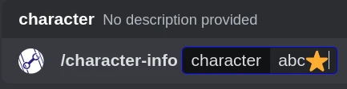
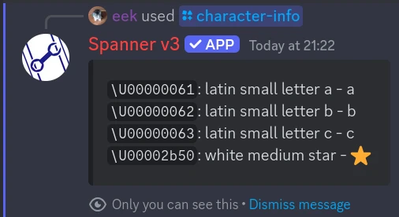

# /character-info | Character Info

Character info is a more specialised version of [/emoji info](./emoji-info.md),
providing information about a specific unicode character. 
This includes the character's unicode code points, names, and values.

Most people will not get much use out of this command, however it may be of use to developers.

## Usage

```text
/character-info character:abc
```

This will display all information about the character `abc`.
You can also specify characters in the traditional `:name:` format, or more specifically with `<:name:id>`.



