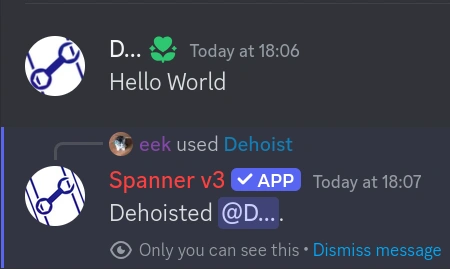

# Dehoist

!!! tip "Can't see the command?"

    This command is a user-context command. This means you need to right-click a member (in the member list, or in
    chat), hover over "Apps", and click "Dehoist".

    If you are on mobile, you can do this by tapping on a member, scrolling to just below their "About Me",
    and tapping "Apps", and then "Dehoist".

!!! warning "Permissions required: user, bot"

    The bot must have the `Manage Nicknames` permission **and** have a higher role than the target user in order to
    change their nickname.

    You must have the `Manage Nicknames` permission in order to use this command.

`Dehoist` is a moderation tool that allows you to "de-hoist" a user.

"Hoisting" is when you put special characters, like `!`, in the front of your username or nickname, in order to 
appear higher on the member list than other people.
This feature of discord is often abused by users to appear higher on the member list to advertise or promote 
inappropriate messages in their name, avatar, or status.

`Dehoist` will put a special invisible character in front of the user's display name, which will send them to
near the bottom of the member list.

!!! danger "Users may get around this by changing their nickname again."

    The `Dehoist` command is an one-shot operation - once you've ran it, its done.
    If you want to ensure that people remain de-hoisted after changing their nickname, you will need to make sure
    that they don't have the `Change Nickname` permission in the server.

## Usage

The command will also send a log in the moderation log if `member.nickanme-change` is an enabled
[Log Feature Flag](../features/Logging.md#2-setting-up-what-you-want-to-log)
