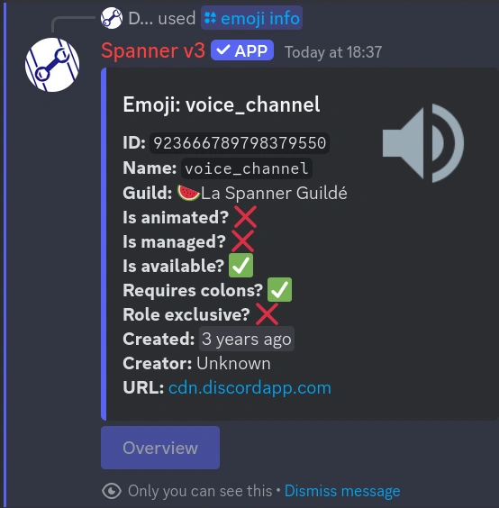
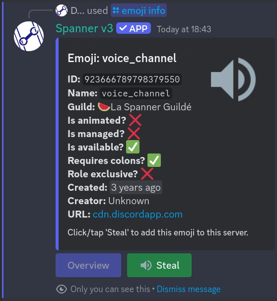

# /emoji info | Emoji Info

!!! tip "This feature is available everywhere!"

    This command is available in both a guild install, and user install! See
    [Installation](../0000-getting-started.md#1-installation) for more information!

Emoji Info gives you a bunch of information about the given __custom__ emoji.

The information given to you includes: 

* name
* ID
* server name
* whether it is animated
* whether it is managed (by an integration, such as twitch)
* whether it is available (for use)
* whether it requires colons to use
* whether it is [exclusive to roles](./emoji-set-roles.md)
* when it was created
* who created it (if available)
* the URL to the emoji

Programmers may be interested in [/character-info](./character-info.md) for information about a specific unicode
characters, including their unicode code points, names, and values.



## Usage

```text
/emoji info emoji:730875482421067848
```

This will display all information about the emoji with the ID `730875482421067848`.
You can also specify emojis in the traditional `:name:` format, or more specifically with `<:name:id>`.

### Stealing emojis

The `emoji info` command comes with an additional feature that was very popular with Spanner v2 - the ability to
clone emojis from other servers into your own.

!!! warning "Permissions: user, bot"

    Both yourself and the bot must have `Create Expressions` permissions in the server you want to put the emoji in.

If you do not already have an emoji with the same name, and both you and the bot have permissions, you will see a
"Steal" green button next to the bottom of the embed:       



If you click on "Steal", the button will load for a second, disable itself, and then change its text a few times,
indicating the progress.


That exact emoji, name and all, will be copied into your server, and you will be able to use it as if it were your own.

Please, however, be courteous - ask for permission before doing this.
