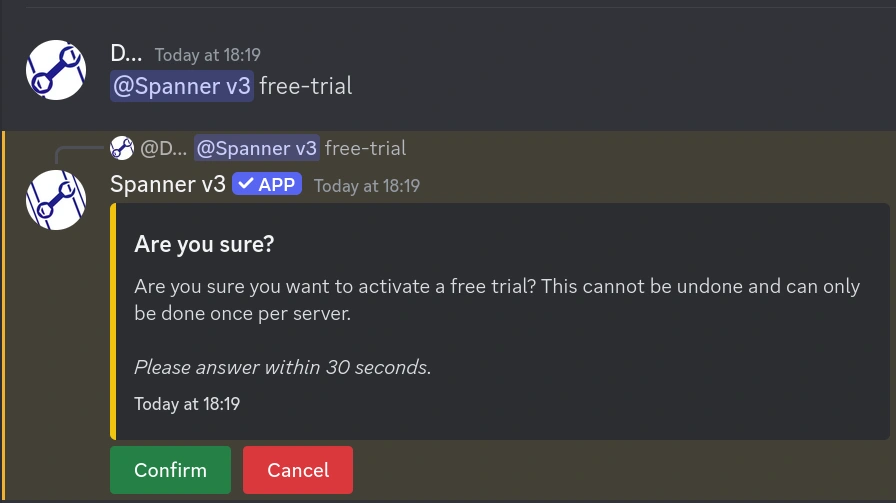
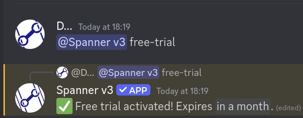
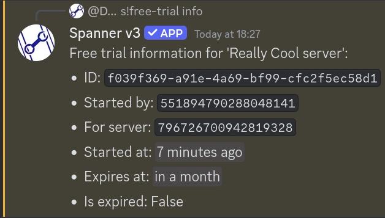

# @Spanner free-trial | Free Trial

Spanner offers a free trial system for users to try out the premium features of spanner for a month before
deciding whether they would like to purchase either a key or subscription or not.

**You can read more about Premium [here](../../premium.md).**

!!! note "This command is a text-based command, so you must mention the bot to be able to use it."

    If you are in a DM with the bot, you can use `s!`. Otherwise, you must prefix your message with `@Spanner `.

!!! warning "Permissions: user"

    You must have the `Manage Server` permission in order to use this command.  

## Usage (redeeming a free trial)

Assuming you have never redeemed a free trial in the server before, you can simply run `@Spanner free-trial`.

Once you run free-trial, assuming you have never redeemed a free trial before, you will be asked to confirm that you
want to redeem it. Remember, **once you do, you cannot pause, cancel, renew, extend, or re-claim later!**

If you confirm, Spanner will activate your free trial, and you will have access to all the premium features for
a full month (30 days from the moment you ran the command, to be precise, down to the second).
Spanner will edit the message to confirm that it has been applied and is now active:

### Viewing information

You can view the information about your free trial by running `@Spanner free-trial info`.

The information displayed is mostly helpful for developers, however it will also tell you:

* Who activated your free trial (the user ID)
* When the free trial was activated
* When the free trial will expire

  

## FAQ

### Can I buy a subscription during a free trial?

If you have an active free trial, and purchase a subscription while the free trial is active, the free trial will
**immediately expire**, and the subscription will take over. Due to the way discord works, we cannot reject
or suspend the subscription, so please be sure you want to do this before you do. Your subscription will apply
immediately.

### Can I use a free trial if I've already had a subscription before?

As long as you haven't used your server's free trial before, you can redeem it. Regardless.

### I accidentally activated the free trial / someone activated the free trial without my permission!

If you or someone else activated the free trial without the intent to do so, there is nothing we can do.

If you join the support server and make a case to the developers, they may be able to extend your free trial,
however (as enforced by the database), free trials physically cannot be deleted or removed, and as such will always
have been in an "activated" state, thus preventing you from redeeming another one.
