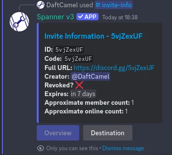
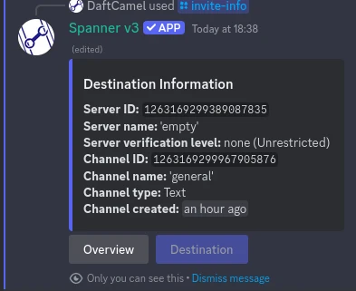
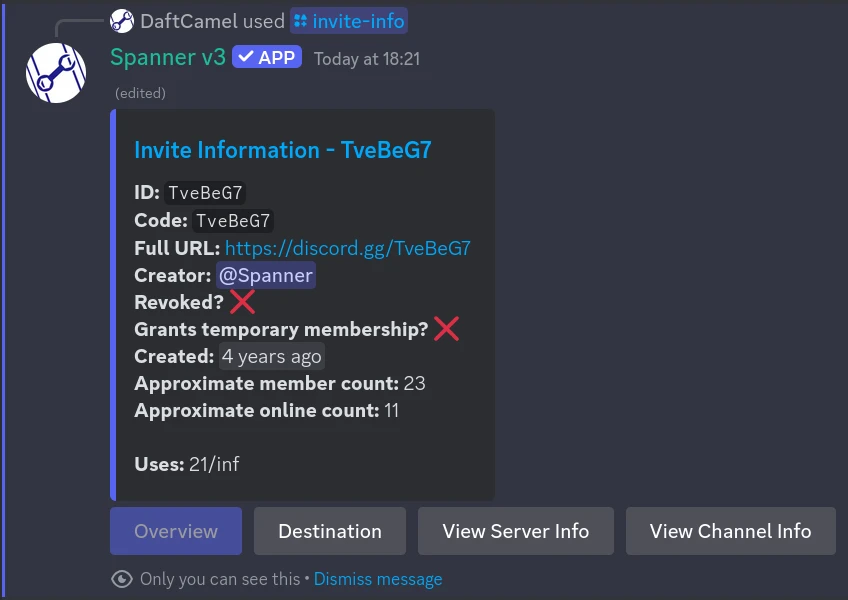
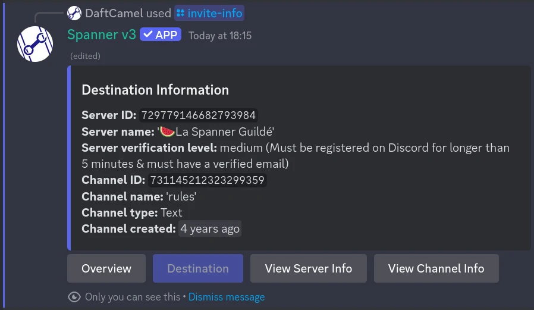

# /invite-info - Invite Info

!!! tip "This feature is available everywhere!"

    This command is available in both a guild install, and user install! See
    [Installation](../0000-getting-started.md#1-installation) for more information!

Invite info gives you a preview of what server the given invite leads to.

In most cases, you will get:

* ID/Code
* Proper URL
* The person who created the invite
* If the invite is revoked
* When the invite expires, if at all
* The approximate member count of the destination server
* The approximate number of online members in the destination server
* The destination server ID
* The destination server name
* The destination server verification level
* The destination channel name
* The destination channel type (text, voice, etc.)
* When the destination channel was created

If you link to an invite to a server that spanner is in, you get access to the same additional information from
[/server-info](./server-info.md) and [/channel-info](./channel-info.md).

## Usage

```text
/invite-info invite:discord.gg/5vjZexUF
```

`invite` can either be just the code (after the `/` in the URL), `discord.gg/<...>`, or a full URL

Currently, the only URLs supported are `discord.gg` and `discord.com/invite`.
Support for third party "vanity invite" services is planned, however this is likely to be unreliable anyway.

## Examples

### A server that Spanner is NOT in

??? example "Click to expand (basic info)"

    
    

### A server that spanner IS in

??? example "Click to expand (extended info)"

        
        
        
    
