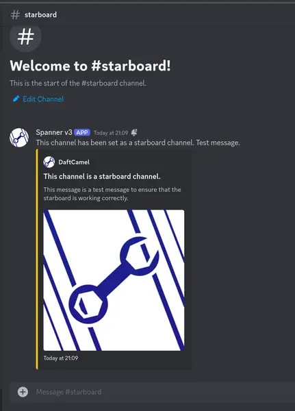
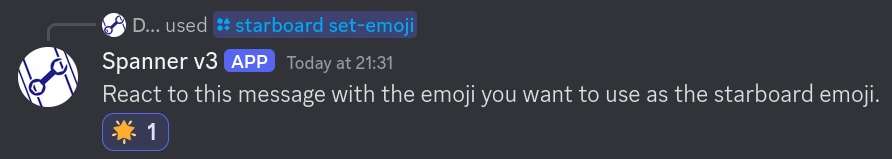

# Starboard

The starboard feature allows you to "star" messages, and have them re-sent in a dedicated channel, where they will remain
until they lose their stars. This is a great way to keep track of funny messages, or messages you want to keep.

!!! tip "Starboard changes are not retroactive."

    If you change a starboard setting, it will not retroactively apply to existing starboard entries. If you want to
    "refresh" a starboard entry, go to its source message (usually via the jump URL), and add/remove a reaction.
    This will "remind" the bot the message exists, and will update it accordingly.

## 1. Setting up the starboard

You can run `/starboard set-channel` and specify which channel you would like to send starred messages to.

After running the command, Spanner will send a test message, which it will then delete, and will then reply to your
command telling you it successfully set the channel.

## 2. Setting the minimum requirements for a message to be starred

You can use `/starboard set-threshold` to set the minimum number of stars a message needs
in order to be sent to the starboard.

!!! danger "Messages with sub-threshold star counts will be removed!"

    The following conditions will cause a message to be removed from the starboard:

    1. The message has all of its reactions cleared (by a moderator)
    2. The message has its star reactions cleared (by a moderator)
    3. The star emoji changes, and the message's reactions are updated (meaning it no-longer meets the threshold)
    4. The bot needs to edit the message, but the starboard channel cannot be found
    5. The bot needs to edit the message, but the starboard channel is not accessible, or the message is missing

    Once removed from the starboard, the message's database entry is deleted, and can only be re-created when it
    meets the threshold again.

### Explicitly setting count

The default mode for starboard is "count" - this means once the number of stars on a message reaches the threshold,
it will be sent to the starboard.

Make sure you set `mode` to `COUNT`! This is also the default.

### Explicitly setting percentage

There's an alternative option available, which is `PERCENT`. This mode will send a message to the starboard if
the number of star reactions equates to `<threshold>%` of the number of members in a channel.

This means that, in a public channel that everyone can see, `N%` of those members must react.
It also means that, in private channels (such as staff channels), `N%` of members in that channel must react.

In summary, if you set your threshold to 10%, and you have 50 members who can see channel,
you will need 5 reactions to star a message.

## 3. Set a star emoji

The default emoji for starboard is ⭐. However, you can change this with `/starboard set-emoji`.

!!! danger "Changing the emoji will BREAK all starred messages!"

    If you change the emoji used for starring messages after a starboard has already been established, existing messages
    will be up for deletion if they have their reactions updated.
    This is because, if you have a message with 5 ⭐ emojis, and then change the emoji to ❤️, the message
    will no longer meet the threshold as the number of ❤️ reactions will be zero. This means that if someone were
    to add/remove/clear a reaction on the message, discord would remind the bot that the message exists, it will see
    that it doesn't meet the threshold anymore, and will remove it, even thought it was previously valid.   

`set-emoji` will send a message, asking you to react to it with the reaction you want to use.

---

After you've added a new emoji reaction to the message, Spanner will double-check that it can use the reaction itself
(thus allowing you to use custom emojis, if you so desire, however discouraged). Then, it will remove the reaction,
and will edit the message to confirm that the emoji was added.  

All done! Now, if you add your new emoji in a reaction to a message, it will count towards the number of stars on a
message.

## 4. Toggle whether bot messages can be starred

!!! info "Bot messages are **enabled** by default."

If you want to allow bot-generated messages (such as replies to commands) to be starred, you can run
`/starboard bot-messages enable:Yes`.
Alternatively, to disable them, you can run `/starboard bot-messages enable:No`.

## 5. Toggle whether users are allowed to star their own messages

!!! Info "Self-stars are disabled by default."

If you want to prevent people from starring their own reactions, run `/starboard self-star enable:No`.
Otherwise, to allow them, run `/starboard self-star enable:Yes`.
